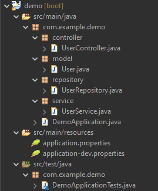
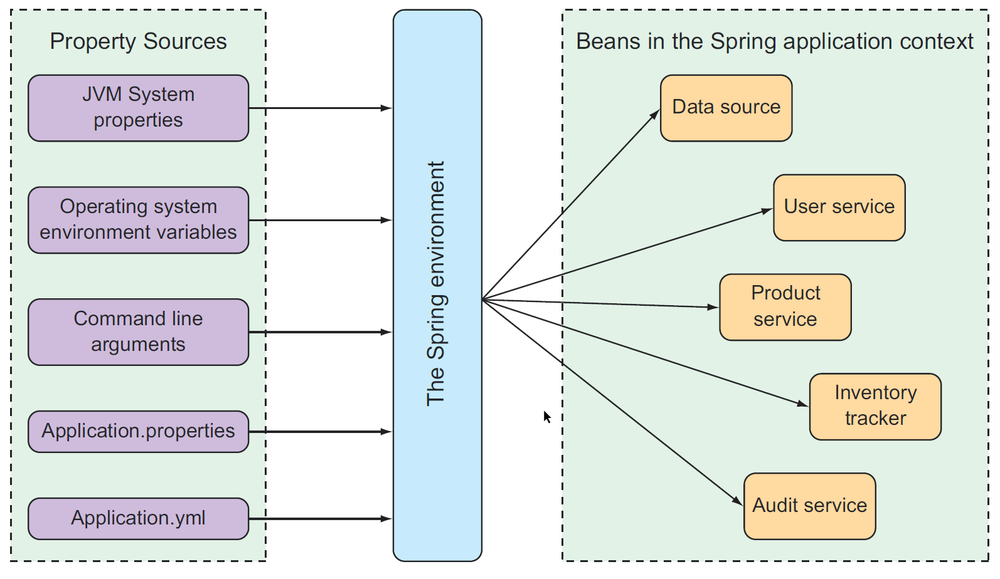
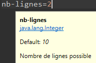

# Structure et configuration
# d’un projet Spring Boot 

--
# Structure type Spring Boot

 <!-- .element: class="image-large" -->

--
# La classe Application

* On retrouve le découpage en couches classique : controller\, repository\, model… 

* La particularité est la classe     \*Application    : 

* @SpringBootApplication 

* public         class         DemoApplication     \{ 

* public         static         void         main    (    String    []     args    ) \{ 

* SpringApplication    \.    run    (    DemoApplication    \.    class    \,     args    ); 

* \} 

* \} 

* Il s’agit d’un bean Spring permettant de lancer l’application 

* L’annotation     @SpringBootApplication     combine les annotations :     @Configuration    \,     @EnableAutoConfiguration     et     @ComponentScan 

--
# Les fichiers application-*.properties

* Les properties doivent suivre le pattern     application\-\*\.properties     pour être chargés automatiquement 

* Le fichier     application\.properties     est chargé par défaut 

* Les autres fichiers sont chargés ou non selon les profiles activés 

* On verra dans la partie suivante la gestion des profiles et properties 

* TP1 :  

* Créer son projet Spring\-Boot 

* Spring Boot Configuration 

--
# Premières fonctionnalités

* Les premières fonctionnalités Spring\-Boot concernent la gestion des properties 

* Permet de centraliser et rendre accessibles les properties de différentes sources 

* Outil de gestion des jeux de properties selon les différents environnements (profile) 

* D’autres fonctionnalités plus avancés comme le cryptage de properties 

--
# Centralisation : l’objet Environment

*  Spring\-Boot centralise les properties de différentes sources au sein de l’objet     Environment 
*  Les properties de différentes origines sont ainsi rendues accessibles à toute l’appli via     @Value     ou encore     @ConfigurationProperties 
*  Un ordre défini la priorité des properties selon la source : 
   *  ligne de commande 
   *  variable d’environnement 
   *  fichier de profile 
   *  application\.properties      
   *  @PropertySource 
   *  @ConfigurationProperties 
   *  Propriétés par défaut \.\.\. 

--
# Schéma de gestion des properties

* Gestion des properties 

--
# Injection de properties

* La première technique pour récupérer une properties est     @Value(    "$\{ma\.prop\}"    ) 

* Spring offre un language d’expression régulière puissant appelé SpEL (Spring Expr\. Langage) 

      $\{\.\.\.\}     permet de faire référence aux properties 

* On peut aussi définir plus finement ce que l’on souhaite injecter (valeurs par défaut\, valeurs conditionnelles\.\.\.) 

* Par ex :     @Value    (    "$\{ma\.prop\} : ‘defaultValueSiAbsent’"    ) 

* On peut définir des expressions ternaires\, parcourir des collections\, exécuter du Java… 

* But stay KISS \!\!\!  

--
# @ConfigurationProperties

* Spring Boot offre un autre mécanisme intéressant pour injecter un ensemble de propriétés dans un bean 

* Il faut créer un bean et l’annoter avec     @ConfigurationProperties 

* Les noms des attributs de ce bean doivent correspondre au nom des properties 

* Les tirets\, underscores\, points doivent être remplacés par du camelCase 

* Ex : ma\-super\-property → maSuperProperty 

--
# @ConfigurationProperties : exemple

* @ConfigurationProperties    (    prefix    =    "database"    ) 

* public         class         DatabaseProperties     \{ 

* private         String         username    ; //Pointe vers database\.username 

* private         Integer         nbConnection    ; // Pointe vers database\.nb\-connection 

* \.\.\.\} 

* Les attributs du bean sont alimentés automatiquement avec les properties disponibles 

* Le prefix permet de cibler un ensemble de properties lié à un domaine de l’appli (bdd\, batch…) 

* On déclare ensuite la classe comme un bean\, ou bien avec     @EnableConfigurationProperties    (    value     =     DatabaseProperties    \.    class    ) 

--
# Le module spring-boot-configuration-processor

*  Avec l’annotation     @ConfigurationProperties     on peut utiliser la librairie     spring\-boot\-configuration\-processor 
*  Celle\-ci permet d’avoir plusieurs fonctionnalités intéressantes : 
   *  auto\-complétion des fichiers properties (avec Eclipse version récente) 
   *  ajout de meta\-données sur les properties depuis les commentaires ou annotations Java 
   *  validation du contenu des properties 
*  Un fichier     spring\-configuration\-metadata\.json     est  généré dans target/\.\.\./classes/META\-INF qui contient les meta\-données 

* Ex avec : 

* /\*\* 

      \* Nombre de lignes possible 

      \*/ 

* private         Integer         nbLignes         =         10    ; 

* On aura de l’auto\-complétion et des infos au survol :  

* Attention : Faire un Maven clean \+ install pour que les modifs soient prises en compte 

* Il est possible d’ajouter des contraintes de validation avec Jakarta\. Ex :     @Min    \,     @Max    \,     @NotNull    \.\.\. 

* Il faut alors annoter la classe avec     @Validated     pour que la validation soit effectuée au démarrage du serveur 

* Les profiles : outils pour le multi\-environnement 

--
# A chaque environnement sa config !

* Pour une même application\, on a des environnements d’exécution différents :     dev\, qualif\, prod ou test 

* Les configurations sont différentes\. Par ex\. les chaînes de connexion vont changer entre les environnements 

* On peut avoir carrément des composants différents selon les contextes d’exécution 

* Ex : base mémoire embarquée pour les tests\, mock pour certaines API en dev et qualif etc\. 

* Spring propose les Profiles pour gérer ces différents environnement et passer simplement de l’un à l’autre 

* Spring Boot va encore plus loin pour faciliter les configurations multi\-environnement 

--
# Des jeux de properties par profile

* On va donc définir un Profile pour chaque environnement d’exécution du code applicatif 

* Spring\-Boot charge par défaut le     fichier     application\.properties     situé dans     /resources 

* On pourra ensuite surcharger les properties par défaut ou en ajouter d’autres avec des fichiers     application\-\{profile\}\.properties 

* Spring chargera le fichier properties correspondant à (ou aux) profile activé (cf suite) 

--
# Rattacher un bean à un @Profile

* On pourra rattacher un bean à un Profile avec l’annotation      @Profile(    "nomDuProfile"    ) 

* Cette annotation peut s’utiliser sur un bean annoté     @Component     ou dérivé\, sur un bean     @Configuration     ou     @ConfigurationProperties    \, ou enfin sur une méthode     @Bean     qui produit un bean 

* Le bean ne sera créé que si le profile mentionné par l’annotation est activé 

--
# Activation des profiles

* Spring Boot permet d’activer les profiles avec la property :     spring\.profiles\.active 

* On peut la définir dans un fichier properties (peu d’intérêt)\, ou encore en variable d’environnement ou en ligne de commande 

* On peut activer plusieurs profiles en les séparant par une virgule… 

* But stay KISS \!\!\!  

* Enfin\, pour pouvoir tester ses profiles\, ou activer un profile de test\, on peut utiliser au sein d’une classe de test l’annotation :     @ActiveProfile(    "test"    ) 

* TP2 :  

* Properties & Profiles 

* Merci de votre attention 

* Avez\-vous des questions ? 

* Prénom Nom         Philippe SABAA 

* Mél : philippe\.sabaa@insee\.fr

* Prénom Nom         Clément LAURONT  

* Mél : clement\.lauront@insee\.fr

* Avec la participation attentive et bienveillante de    Valentin Batard    (dans le rôle du PO)

* Insee 

* Établissement :    SNDI \- Nantes 

